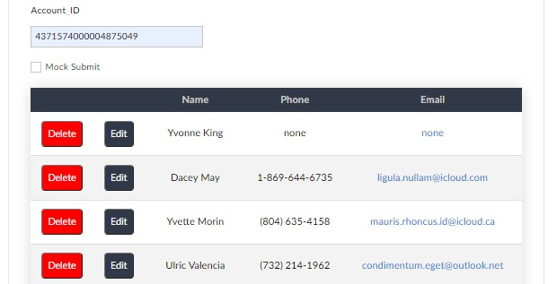

# Create an HTML Table in Zoho Creator Using Deluge and Notes

## Use Case
An HTML table can be a helpful way to show an external user with no access to the connected CRM a list of related records to a parent record. Some use cases could be a list of related appointments, inventory, or household members. Clickable links and buttons can be added in the table rows to access particular information about each record. 



## Set Up
Prior knowledge of HTML, CSS, and Deluge will be helpful. For this example, we will show a list of all related contacts for an Account Record. 
We will set up the following:

* A Zoho Creator form with:
  * a note field
  * an Account ID field
* User input workflow to initalize the table

You will need to have in place:

* CRM oauth connection in Creator


```
if(input.Account_ID != null)
{
	//if you want to style the whole table at once, start with this and append the start of the table to this first x
	x = "<head><style> td { text-align: center;  padding: 12px 15px; }th {background: #313949; color:#CAC7C3; text-align:center; padding: 7px 5px;}button{color:white; padding: 8px 7px; border-radius: 5px}.edit{background-color: #313949;}.delete{background-color:red }table{width: 100%; margin: 0 auto; box-shadow: 0 0 20px rgba(0, 0, 0, 0.15); border-collapse: collapse; background-color: white;} tbody tr:nth-of-type(even){background-color:#f3f3f3;} tbody tr{border-bottom: 1px solid #dddddd;} tbody tr.active-row{font-weight: bold;color: #009879;}.edit a{color:white}</style></head>";
	//create a note in your form, and put the table structure in the notes if you want it to show up in mobile(?)
	//start the table
	x = x + "<table>";
	x = x + "<thead><tr><th></th><th></th><th>Name</th><th>Phone</th><th>Email</th> </tr> </thead>";
	x = x + "<tbody>";
	//iterate through all contacts in hh
	getRelatedContacts = zoho.crm.getRelatedRecords("Contacts","Accounts",input.Account_ID);
	for each  contact in getRelatedContacts
	{
		getRec = zoho.crm.getRecordById("Contacts",contact.get("id").toLong());
		if(getRec.get("First_Name") == null)
		{
			getFName = "";
		}
		else
		{
			getFName = getRec.get("First_Name");
		}
		getLName = getRec.get("Last_Name");
		if(getRec.get("Phone") == null || getRec.get("Phone").equalsIgnoreCase(""))
		{
			ph = "none";
		}
		else
		{
			ph = getRec.get("Phone");
		}
		if(getRec.get("Email") == null || getRec.get("Email").equalsIgnoreCase(""))
		{
			email = "none";
		}
		else
		{
			email = getRec.get("Email");
		}
		//adds the name, phone and email. to the table row. append the x variable so it's storing it each time. Click delete will delete record, edit will naviate to crm to make changes, email will open email client. 
		x = x + "<tr><td><button class='delete'><a href='https://creatorapp.zoho.com/user1_demo121/yk-fd-tutorial/#Form:Delete_Confirmation?Account_ID=" + input.Account_ID + "&Contact_ID=" + contact.get("id") + "'>Delete</a></button></td><td><button class='edit'><a href='https://crm.zoho.com/crm/org707073965/tab/Contacts/" + contact.get("id") + "'target='_blank'>Edit</a></button></td><td>" + getFName + " " + getLName + "</a></td><td>" + ph + "</td><td><a href='mailto:" + email + "'>" + email + "</a></td></tr>";
	}
	//close the table tags
	x = x + "</tbody></table>";
	//make the notes =  to x where we have been storing the table 
	//input.plain = x;
	//this is the blank note I created
	input.plain1 = x;
	show plain1;
}
add code block here

```
