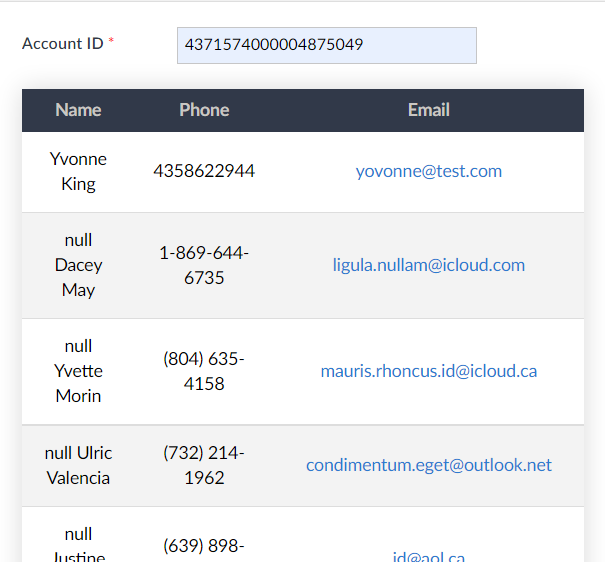

# Create an HTML Table in Zoho Creator Using Deluge and Notes

In a Zoho Creator application, an HTML table is a helpful way to display a list, such as appointments, inventory, or contacts to external users. Clickable links and buttons can be included in the table rows to add navigation functionality, like clicking the email link to open an email client, or an edit button to navigate to an edit contact form.



<p><em>Contact infomation in the snippet was randomly generated and is NOT real contact information</em></p>

## How it Works
Adding a table to a Creator form is done through a Note field in the form. In a workflow, a variable is created to contain the HTML and CSS syntax and will be appended to throughout. Records are appended to the variable as rows in the table using a for each loop. Once all rows are added and the HTML tags are closed, the Note field will then be set to equal the variable. 

In order to use HTML/CSS in Deluge, the HTML and CSS syntax must be enclosed with quotation marks. 


## Set Up
Prior knowledge of HTML, CSS, and Deluge will be helpful. For this example, we will show a list of all related contacts for an Account Record.
You will need to set up the following:

* A Zoho Creator form with:
  * a blank note field
  * an Account ID field
* CRM oauth connection in Creator 

Create a workflow on the user input of the Account ID field, and add a new action. Let's begin with writing an if statement on the condition that the Account ID is not null.


```
if(input.ACCOUNT_ID != null)
{

}

```

Inside of this if statement, let's begin adding the table styling in an HTML head tag and store this in a variable called 'x'. Notice how all of the HTML and CSS syntax are contained in quotations:

```
if(input.ACCOUNT_ID != null)
{
	//style the table
	x = "<head><style> td { text-align: center;  padding: 12px 15px; }th {background: #313949; color:#CAC7C3; text-align:center; padding: 7px 5px;}button{color:white; padding: 8px 7px; border-radius: 5px}.edit{background-color: #313949;}.delete{background-color:red }table{width: 100%; margin: 0 auto; box-shadow: 0 0 20px rgba(0, 0, 0, 0.15); border-collapse: collapse; background-color: white;} tbody tr:nth-of-type(even){background-color:#f3f3f3;} tbody tr{border-bottom: 1px solid #dddddd;} tbody tr.active-row{font-weight: bold;color: #009879;}.edit a{color:white}</style></head>";
	...

```

<em>Note: Inline styling can be used.</em>

Append your table and table header tags to the 'x' variable. My table headers will read "Name", "Phone", and "Email". 


```
...
	//start the table and add the headers
	x = x + "<table><thead><tr><th>Name</th><th>Phone</th><th>Email</th> </tr> </thead><tbody>";
...	

```

Store the list you want to use in a list variable, then iterate through the list with a for each loop, getting the pieces of information you need for each record. In this example, I want to get the first and last name, email and phone number. I have omitted the null and empty checks for brevity, but you may want to add these in case you do not have complete data coming from your CRM. Concatenate the Deluge variables with the HTML/CSS syntax, using opening and closing quotations as needed. 

```
...
	//iterate through all contacts for a particular account record
	getRelatedContacts = zoho.crm.getRelatedRecords("Contacts","Accounts",input.Account_ID);
	for each contact in getRelatedContacts
	{
		getRecord = zoho.crm.getRecordById("Contacts",contact.get("id").toLong());
		firstName = getRecord.get("First_Name");
		lastName = getRecord.get("Last_Name");
		phone = getRecord.get("Phone");
		email = getRecordc.get("Email");
		//
		//adds the current iteration's contact name, phone and email to the table row. Append the 'x' variable so it's storing the contact info each time. Clicking the email will open your email client. 
		//
		x = x + "<tr><td>" + firstName + " " + lastName + "</td><td>" + phone + "</td><td><a href='mailto:" + email + "'>" + email + "</a></td></tr>";
	}
...

```

Append the closing table tags to the 'x' variable, then set the Note field to equal 'x'.

```
...
//close the table tags
x = x + "</tbody></table>";
//set the blank note to equal x
input.YOUR_NOTE_VARIABLE= x;
}
//end of if statement Account_ID == null
```
